# **🔍 Monitoramento de Aplicações Web e Certificados SSL**  

Olá a todos!  

# DASHBOARD TESTES CERTIFICADOS SSL


# DASHBOARD TESTES DISPONIBILIDADE SITES
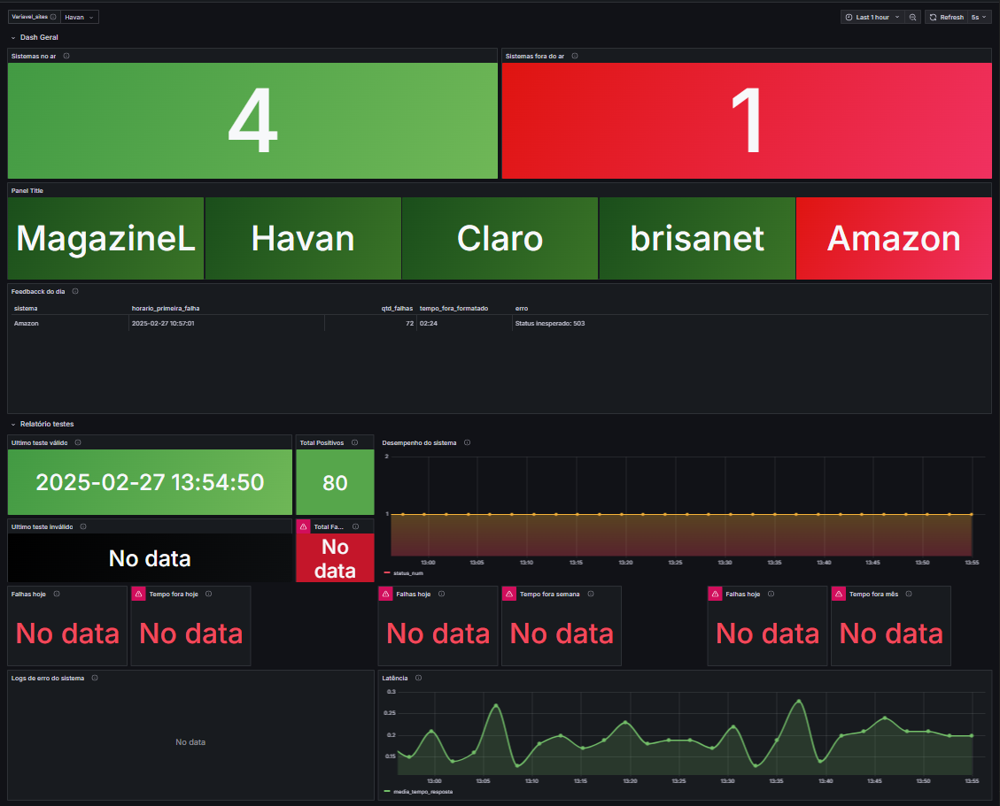

Trago aqui uma solução simples para **monitoramento de aplicações web** e **testes para validação de certificados SSL**.  

---

## **🛠 Tecnologias Utilizadas**
- **Python**
- **Docker**
- **TesteSSL** → [Repositório Oficial](https://github.com/testssl/testssl.sh)

O objetivo era criar uma solução **simples e acessível**, permitindo que até **usuários sem experiência com essas tecnologias** pudessem utilizá-la facilmente via **Docker**.

---

## **🚀 Passo a Passo para Configuração**
### **📌 1- Lista de Domínios a Serem Testados**
Você só precisa definir os domínios no arquivo 📄 `./json/dominios.json`.  

```json
[
  { "sistema": "Amazon", "url": "https://www.amazon.com.br" },
  { "sistema": "MagazineL", "url": "https://www.magazineluiza.com.br" }
]
```

---

### **📌 2- Criar o Arquivo `.env`**
O arquivo **`.env`** é essencial para armazenar as credenciais do banco de dados.  

📄 **Estrutura do `.env`:**
```
DB_NAME=monitoramento_aplicacoes
DB_USER=user
DB_PASSWORD=123456789
DB_HOST=postgres
DB_PORT=5432

# Variáveis para Docker Compose
POSTGRES_USER=user
POSTGRES_PASSWORD=123456789
POSTGRES_DB=monitoramento_aplicacoes
GF_SECURITY_ADMIN_PASSWORD=admin
```

⚠️ **Importante:**  
- **Mude os valores padrão para maior segurança!**  
- **`DB_USER` deve ser igual a `POSTGRES_USER`**.  
- **`DB_PASSWORD` deve ser igual a `POSTGRES_PASSWORD`**.  

---

### **📌 3- Executar o Docker Compose**
📍 **Certifique-se de estar no diretório onde o arquivo `docker-compose.yml` está localizado.**  

🔹 **Comando para rodar o `docker-compose`**:  
```sh
docker-compose up -d --build
```

📦 **Após a execução, os seguintes containers serão criados:**
1. **`python_app_testes_disponibilidade_SSL`** → Responsável por rodar os testes Python.  
   - Copia automaticamente os seguintes arquivos para dentro do container:
     - 📄 `./json/dominios.json` → Lista de domínios.  
     - 📂 `./testes/` → Scripts de teste de disponibilidade e SSL.  
     - 📂 `./testessl/` → Projeto [TesteSSL](https://github.com/testssl/testssl.sh).  
     - 📄 `./executar_testes.py` → Responsável por **executar testes de disponibilidade a cada 2 minutos** e **validar certificados SSL à meia-noite**.

2. **`postgres_disponibilidade_SSL`** → Banco de dados **PostgreSQL** para armazenar os resultados.  

3. **`grafana_disponibilidade_SSL`** → Exibe os resultados **de forma intuitiva**, permitindo criar **alertas por e-mail ou webhook**.

---

## **🛠 Validar a Execução dos Testes**
Caso queira **executar os testes manualmente**, use os comandos abaixo:

📍 **Entrar no container Python**:  
```sh
docker exec -it python_app_testes_disponibilidade_SSL python3 /bin/bash
```

📍 **Rodar um teste manualmente**:  
```sh
python3 ./testes/NOME_DO_TESTE_QUE_VOCÊ_VAI_TESTAR
```

📍 **Acessar o banco de dados PostgreSQL manualmente**:  
```sh
docker exec -it postgres_disponibilidade_SSL psql -U user -d monitoramento_aplicacoes
```

---

## **📊 Configurar o Grafana**
### **📌 1- Acesse o Grafana**
📍 **Abra o navegador e acesse:**  
🔗 [http://localhost:3000](http://localhost:3000)

📍 **Login Inicial:**  
- **Usuário:** `admin`  
- **Senha:** `admin`  
- O Grafana pedirá para **criar uma nova senha**.

📍 **Tela de login do Grafana:**  


---

### **📌 2- Conectar ao Banco de Dados**
📍 **Clique na setinha do menu e vá em "Connections"**  
🔗 [http://localhost:3000/connections/add-new-connection](http://localhost:3000/connections/add-new-connection)

📍 **Tela Home do Grafana:**  
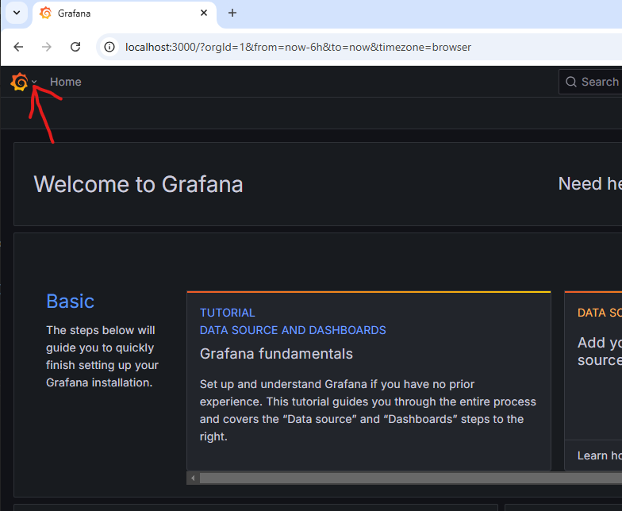

📍 **Tela de conexão ao banco:**  
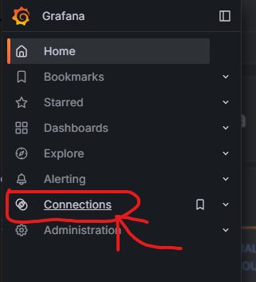

📍 **Selecione PostgreSQL:**  
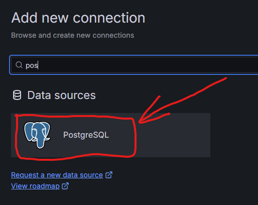

📍 **Adicione a nova fonte de dados:**  
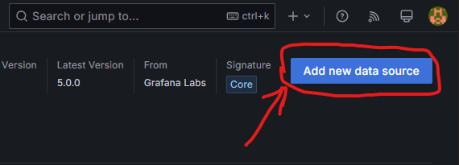

📍 **Preencha os campos:**  
```
Host URL * : postgres_disponibilidade_SSL:5432
Database name * : monitoramento_aplicacoes
Username * : user
Password * : 123456789
TLS/SSL Mode : disable
```
📍 **Clique em "Save & Test".**  
Se o PostgreSQL estiver conectado corretamente, aparecerá a seguinte mensagem:  

📍 **Sucesso na conexão:**  
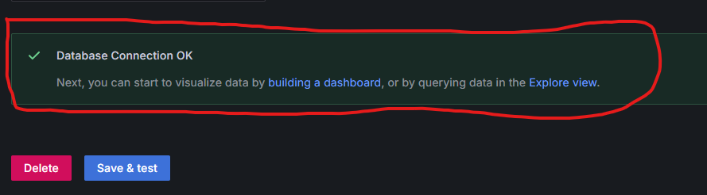

---

### **📌 3- Importar Dashboards do Grafana**
📍 **Acesse:**  
🔗 [http://localhost:3000/dashboards](http://localhost:3000/dashboards)

📍 **Criar uma nova pasta para os Dashboards:**  
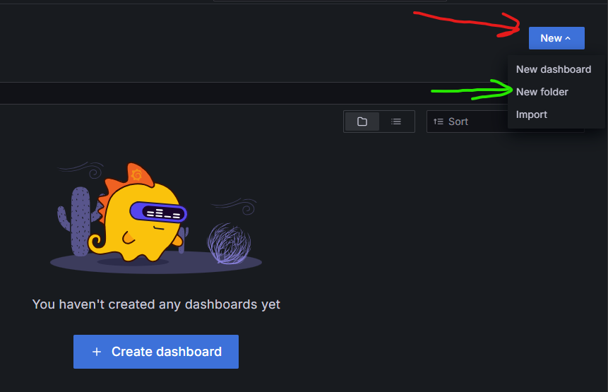

📍 **Criar um Novo Dashboard:**  
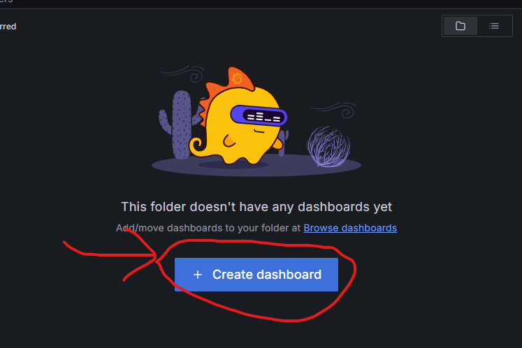

📍 **Importar um Dashboard Existente:**  
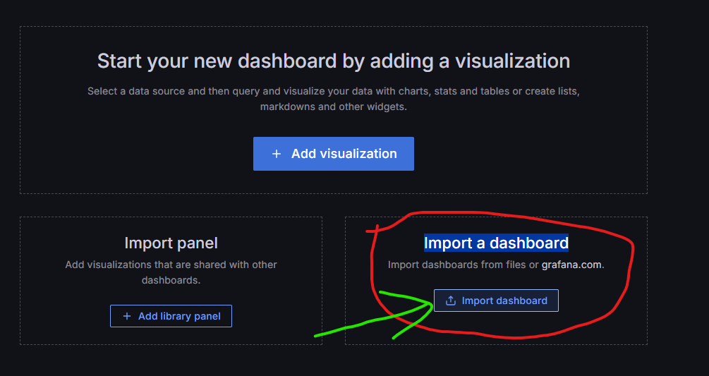

📍 **Salvar as alterações:**  
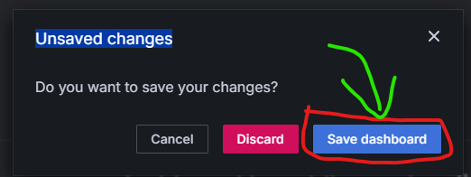

📍 **Selecionar a pasta onde será salvo:**  
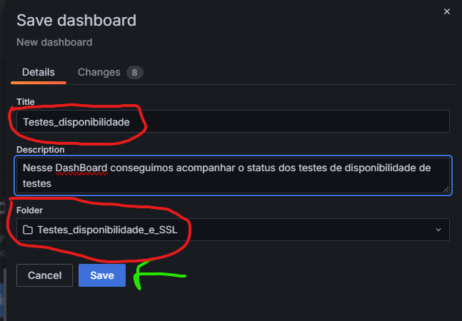

📍 **Importando o JSON:**  
Copie o conteúdo do arquivo **`dash_disponibilidade.json`**, cole na área verde e clique em "Load".

📍 **Importação do JSON:**  
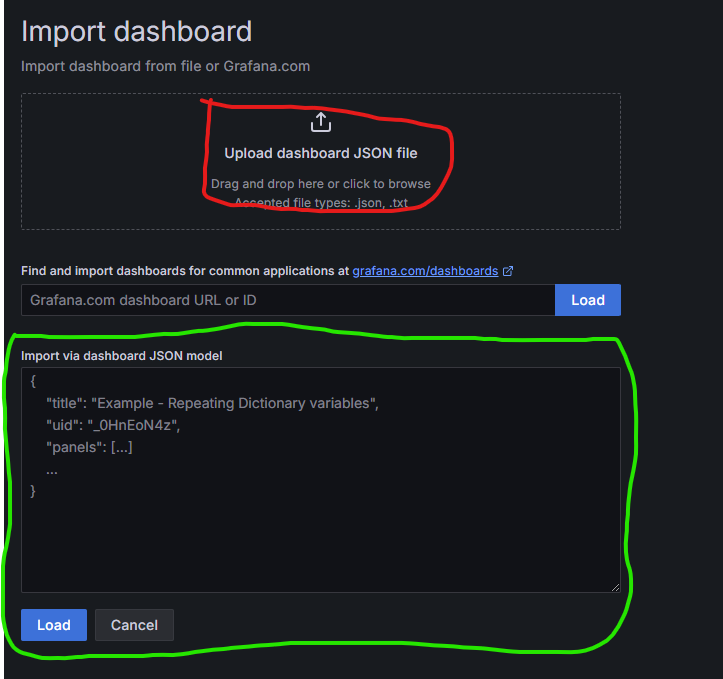

📍 **Visualização do Dashboard no Grafana:**  
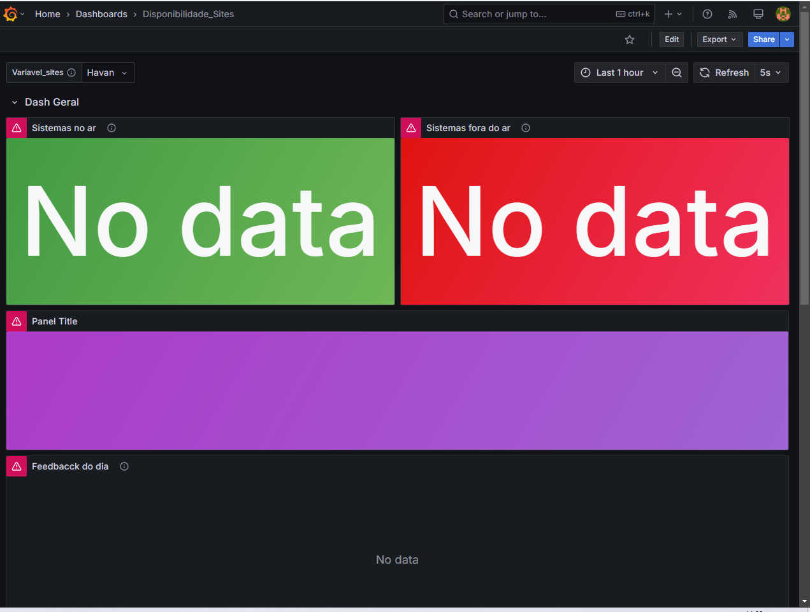

---

## **📌 Caso os dados não apareçam**
1️⃣ **Passe o mouse sobre um painel, clique nos 3 pontinhos e selecione "Edit".**  
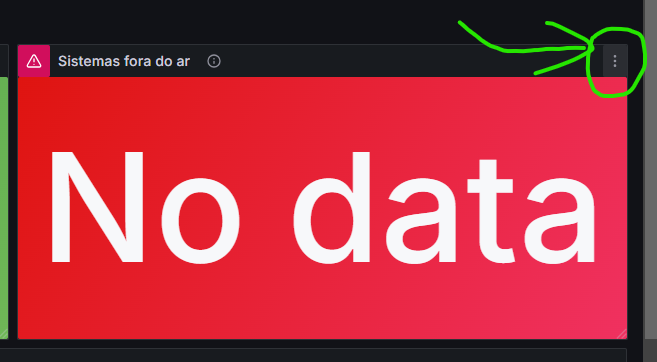

2️⃣ **Na tela de configuração do painel, clique em "Run Query".**  


3️⃣ **Salve as alterações.**  

📍 **Visualização do Dashboard Final:**  
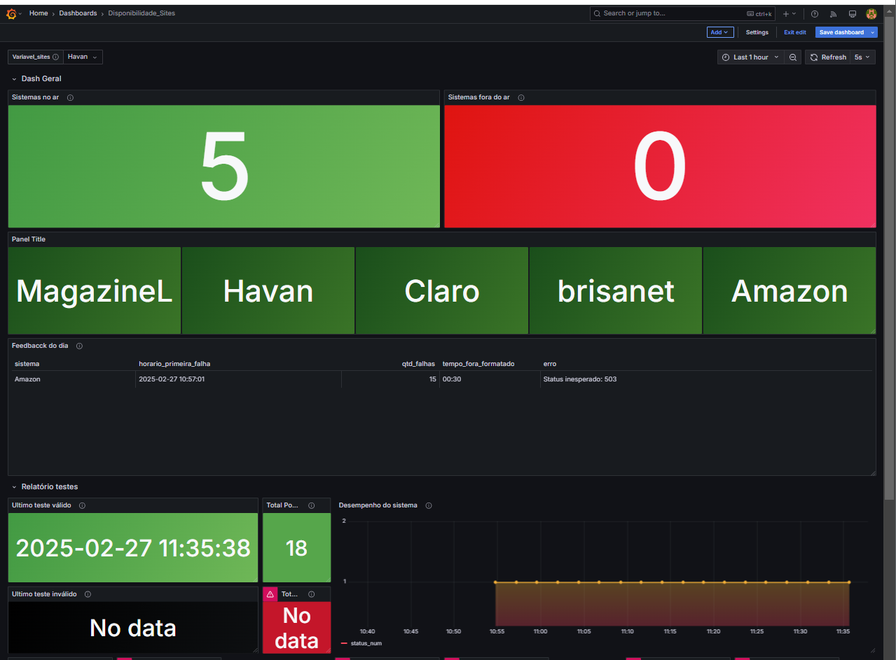

📍 **Dashboard de Certificados SSL:**  
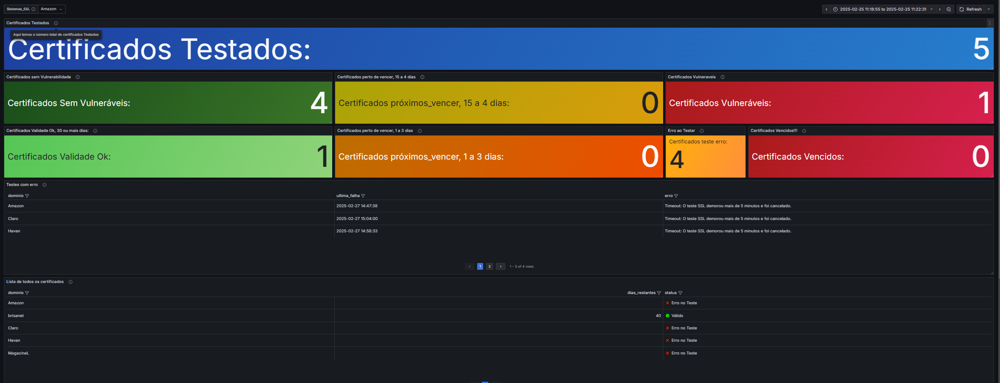

---

## **📩 Dúvidas?**
Caso tenha dúvidas, você pode entrar em contato comigo pelo **LinkedIn**!  
Conforme tiver tempo, responderei suas perguntas. 😊  

